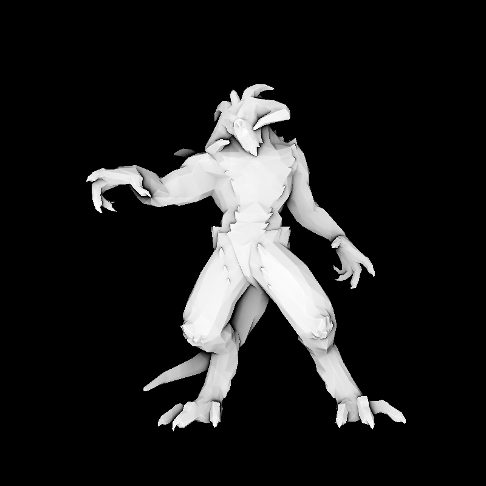
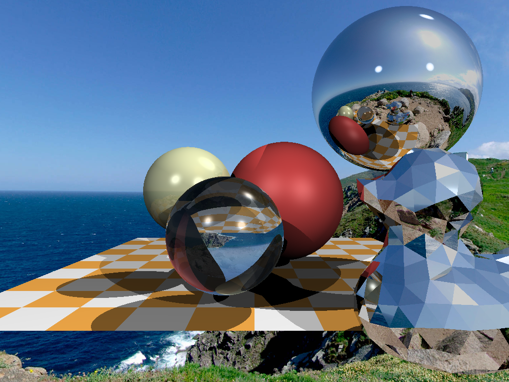
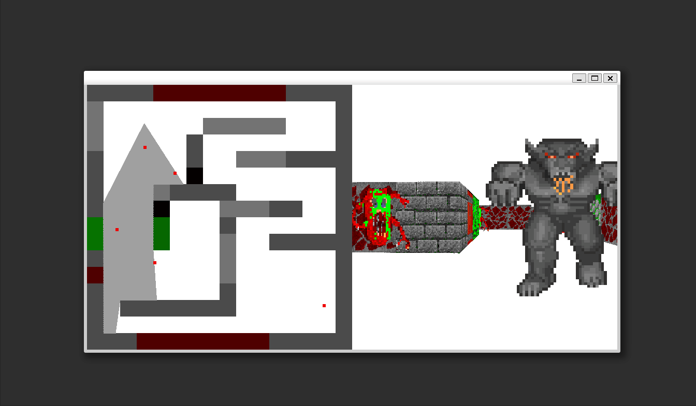
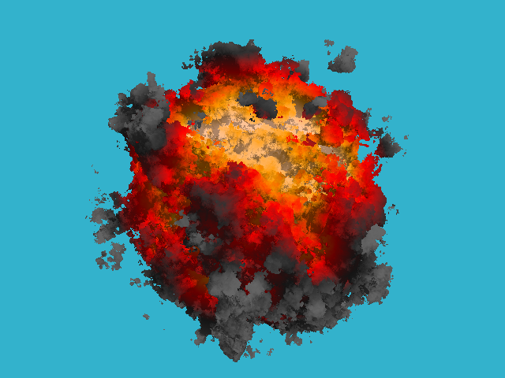
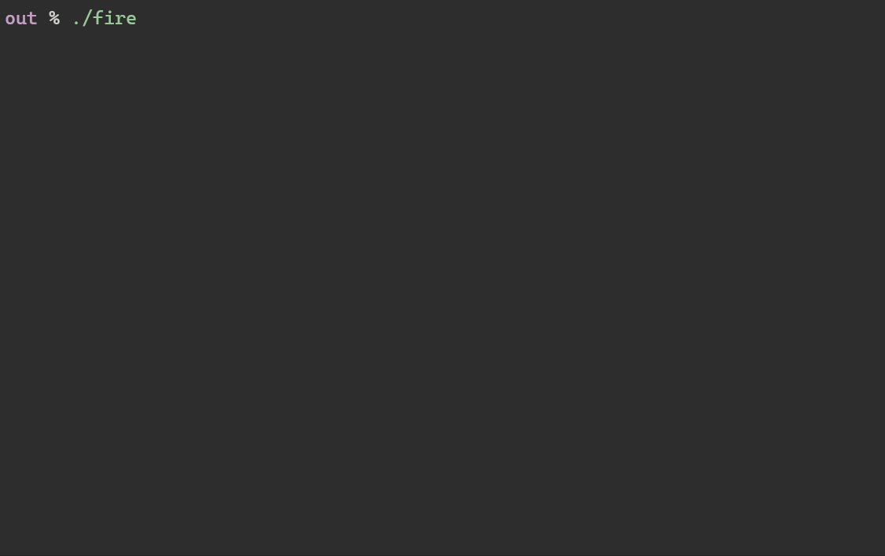
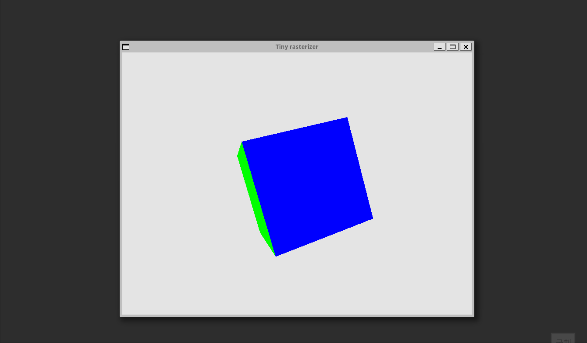

# tiny

The tiny series projects rewritten in Go, including Dmitry V. Sokolov's [tinyrenderer](https://github.com/ssloy/tinyrenderer), [tinyraytracer](https://github.com/ssloy/tinyraytracer), [tinyraycaster](https://github.com/ssloy/tinyraycaster), [tinykaboom](https://github.com/ssloy/tinykaboom), and [tinycompiler](https://github.com/ssloy/tinycompiler), as well as Nikita Lisitsa's [implementing-a-tiny-cpu-rasterizer](https://lisyarus.github.io/blog/posts/implementing-a-tiny-cpu-rasterizer.html).

# images

tinyrenderer

tinyraytracer

tinyraycaster

tinykaboom

tinycompiler

tinyrasterizer

